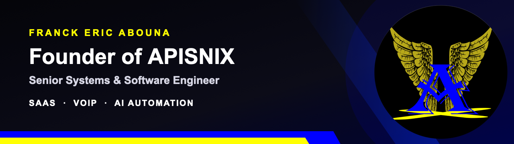

  

<h1 align="center">Franck Eric Abouna</h1>

  <strong>Fondateur d'APISNIX · Ingénieur systèmes & logiciels senior</strong> 
  SaaS · Outils métier · VoIP · Automatisation IA

  <a href="https://apisnix.com">Site APISNIX</a> ·
  <a href="mailto:franck@apisnix.com">E-mail</a> ·
  <a href="https://www.linkedin.com/in/franck-eric-abouna-68b3351b0">LinkedIn</a> ·
  <a href="https://wa.me/33768413182">WhatsApp Business</a>

> **From infrastructure to AI, I build practical systems that solve real business problems.**

Je conçois, déploie et fais évoluer des produits numériques utiles aux entreprises : SaaS, CRM, outils métier, automatisations gouvernées, solutions VoIP et infrastructures Linux. Je travaille à distance avec des équipes et partenaires internationaux.

## Ce que je construis

- **SaaS et applications métier** — produits web mobile-first, CRM, facturation, catalogues et tableaux de bord.
- **Automatisation et IA** — agents IA, workflows n8n, intégrations LLM et processus avec validation humaine.
- **Télécoms et centres d'appels** — Asterisk, VICIdial, SIP, VoIP et intégration CRM/téléphonie.
- **Infrastructure et intégrations** — Linux, Docker, bases de données, API et déploiements sécurisés.

## Quelques repères

| 8+ ans | 30+ organisations | 10 000+ | 45 playlists |
| :---: | :---: | :---: | :---: |
| d'expérience technique | accompagnées à différents niveaux | identités musicales normalisées dans ZikQuiz | dans le catalogue de jeu |

## Produits et projets sélectionnés

### [APISNIX Factures](https://factures.apisnix.com)

SaaS mobile-first de facturation, devis, catalogue, gestion de boutiques, personnalisation graphique, PDF privés et fonctionnement hors ligne partiel. Le produit est actuellement exploité au Cameroun ; son extension internationale est en préparation.

### [L'Eau du Bac](https://leaudubac.com)

Plateforme éducative web et mobile d'annales, exercices, quiz et méthodologies pour le secondaire camerounais francophone et anglophone. Le site et l'API sont en production.

### [ZikQuiz](https://zikquiz.com)

Quiz musical africain et francophone avec modes solo, battles, défis, progression et trophées. L'écosystème web, l'API, la vitrine et l'administration sont en production ; le catalogue compte plus de 10 000 identités musicales normalisées et 45 playlists.

### [APISNIX Platform & Maud AI](https://auto.apisnix.com)

Portail client privé pour le suivi opérationnel, le recouvrement assisté, les approbations, les documents et les automatisations métier. Le pilote est déployé ; les offres multi-clients et certains connecteurs restent en développement.

### CRM, VoIP et automatisation APISNIX

Composants privés réunissant CRM, facturation, relances, tableaux de bord, intégrations télécoms et automatisations contrôlées. Les démonstrations publiques restent volontairement limitées afin de protéger les données et l'infrastructure des clients.

## En cours et études de cas

- **Tapiole** — démonstrateur de marketplace immobilière et d'hébergement au Cameroun ; aucune URL publique pour le moment.
- **Market CRM** — application locale de gestion de supermarché et boutique : caisse, stock, fournisseurs, fidélité, facturation et rapports.
- **Hermes** — infrastructure interne d'agents IA pour l'orchestration de tâches, la veille, le développement et les workflows avec approbation humaine.

## Technologies principales

**Produit & web :** TypeScript, JavaScript, React, Next.js  
**Données & backend :** Supabase, PostgreSQL, MariaDB, MySQL, REST API  
**Infrastructure :** Docker, Linux, Ubuntu, openSUSE, Git, GitHub  
**IA & automatisation :** LLM, agents IA, n8n, intégrations API  
**Télécoms :** Asterisk, VICIdial, VoIP, SIP

## Travaillons ensemble

Je suis disponible pour des missions techniques, le développement de produits et SaaS, le conseil en architecture, l'automatisation IA, les projets VoIP/centres d'appels et les partenariats technologiques.

**Décrivez-moi votre besoin :** [franck@apisnix.com](mailto:franck@apisnix.com) · [WhatsApp Business](https://wa.me/33768413182) · [LinkedIn](https://www.linkedin.com/in/franck-eric-abouna-68b3351b0)
